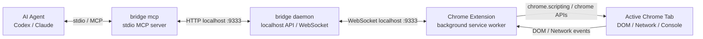

# 3. 全体アーキテクチャ

[設計書トップへ戻る](../DESIGN.md)

## 概要

構成は `AI ←stdio/MCP→ bridge mcp ←HTTP→ bridge daemon ←WebSocket→ Chrome拡張 → 対象ページ` とする。
`bridge mcp`はAIとのMCP通信を担当し、`bridge daemon`はChrome拡張接続とBridge APIを担当する。
AI向けの通信とChrome向けの通信を分けることで、役割と接続状態を明確にする。

## 構成図

## 最終ゴール

`bridge mcp`はAI向けのMCPサーバーとして動き、`bridge daemon`へHTTPで問い合わせる。
`bridge daemon`はChrome拡張とのWebSocket接続を維持し、Chrome上で取得・操作した結果をMCP側へ返す。
Chrome拡張は普段使いChromeのプロファイル、ログイン状態、現在のタブ状態をそのまま利用する。

ソースコード、配布物、拡張表示名は`bridge`へそろえる。
MCP登録名は他ツールとの衝突を避けるため`chrome-bridge`とする。

## 詳細化する項目

- `bridge mcp`と`bridge daemon`の責務分離
- Bridge HTTP APIとWebSocket API
- Chrome拡張内のbackground/content script構成
- 対象タブ選択と実行権限の流れ
- 将来CDPを使う場合の接続位置
