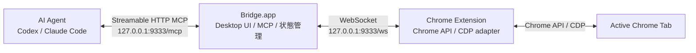

# 3. 全体アーキテクチャ

[設計書トップへ戻る](../DESIGN.md)

## 概要

`Bridge.app`はDesktop UI、Streamable HTTP MCP、Chrome拡張接続を同じプロセスで提供する。
Chrome内でしか実行できない処理はChrome拡張が担当する。

Bridge.appを終了するとMCPとWebSocketも停止する。ウィンドウを閉じただけの場合はメニューバーで継続する。
